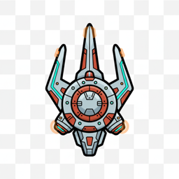
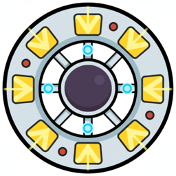
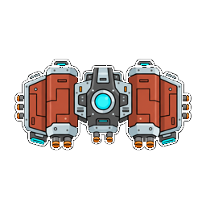
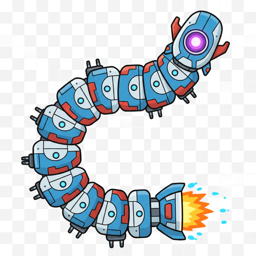
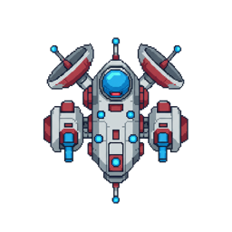
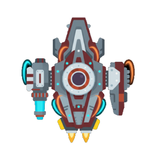

# Enemy Drone Compendium

This is a working design document for enemy archetypes currently referenced by `levels/*.json`.

In the full game, these entries will unlock as the player encounters each enemy.

## Drones

### Armored Test Rig

- Id: `tank`

- Seen in: Overhaul Test Range

- Movement: Slow hauler with mild weave; built to soak damage.

- Weapons: Aimed shots, low cadence.

- Defense: Armor 120 (AC 12) | Hull 45.

### Blue Scout Drone

- Id: `scout`

- Seen in: First Contact, First Contact: Patrol Alpha, Orion Drift, Orion Drift: Skirmish, …

- Movement: Serpentine zig-zag descent.

- Weapons: Aimed shots, low cadence.

- Defense: Hull 18.

### Bulwark Heavy Hauler

- Id: `bulwark`

- Seen in: Iron Graveyard

- Movement: Slow hauler with mild weave; built to soak damage.

- Weapons: Aimed shots, low cadence.

- Defense: Armor 240 (AC 14) | Hull 40.

### Captain-Class Corvette

- Id: `captain`

- Seen in: Crimson Fleet

- Movement: Slides side-to-side while descending.

- Weapons: Radial barrage (14 shots), medium cadence.

- Defense: Hull 320.

### Cargo Transport (Pirated)

- Id: `transport`

- Seen in: First Contact, First Contact: Patrol Alpha, Nebula Run, Void Cascade, …

- Movement: Slow hauler with mild weave; built to soak damage.

- Weapons: Aimed shots, low cadence.

- Defense: Hull 90.

### Dart Skirmisher

- Id: `dart`

- Seen in: Neon Swarm

- Movement: Swoops in from the flank with a bobbing path.

- Weapons: Aimed shots, low cadence.

- Defense: Hull 16.

### Elite Vortex Drone

- Id: `elite`

- Seen in: Last Light

- Movement: Corkscrew spiral path across lanes.

- Weapons: Radial barrage (12 shots), high cadence.

- Defense: Hull 140.

### Escort Gunship

- Id: `escort`

- Seen in: Iron Graveyard

- Movement: Slides side-to-side while descending.

- Weapons: Spread volley (5 shots, 0.9 rad), low cadence.

- Defense: Armor 90 (AC 10) | Hull 32.

### Gnat Interceptor

- Id: `gnat`

- Seen in: Crossfire Corridor, Neon Swarm

- Movement: Serpentine zig-zag descent.

- Weapons: Aimed shots, low cadence.

- Defense: Hull 12.

### Harvester Bomber

- Id: `harvester`

- Seen in: Annihilation Protocol, The Gauntlet, Last Light

- Movement: Swoops in from the flank with a bobbing path.

- Weapons: Spread volley (9 shots, 1.3 rad), medium cadence.

- Defense: Hull 220.

### Hunter Pursuit Drone

- Id: `hunter`

- Seen in: First Contact, Orion Drift, Orion Drift: Skirmish, Nebula Run, …

- Movement: Actively hunts the pilot; aggression ramps over time.

- Weapons: Aimed shots, low cadence.

- Defense: Hull 30.

### Interceptor Wing

- Id: `interceptor`

- Seen in: First Contact: Patrol Alpha

- Movement: Swoops in from the flank with a bobbing path.

- Weapons: Aimed shots, low cadence.

- Defense: Hull 22.

### Lurker Ambush Probe

- Id: `lurker`

- Seen in: First Contact, First Contact: Patrol Alpha, Orion Drift, Nebula Run, …

- Movement: Lurks until you enter its aggro radius, then pursues.

- Weapons: Aimed shots, low cadence.

- Defense: Hull 24.

### Marauder Spiralwing

- Id: `marauder`

- Seen in: Orion Drift, Orion Drift: Skirmish, Nebula Run, Void Cascade, …

- Movement: Corkscrew spiral path across lanes.

- Weapons: Spread volley (5 shots, 0.9 rad), medium cadence.

- Defense: Hull 36.

### Overseer Command Skiff

- Id: `overseer`

- Seen in: Annihilation Protocol, The Gauntlet, Last Light

- Movement: Swoops in from the flank with a bobbing path.

- Weapons: Radial barrage (18 shots), medium cadence.

- Defense: Hull 260.

### Phantom Spiralwing

- Id: `phantom`

- Seen in: Void Cascade, Annihilation Protocol, Crimson Fleet, The Gauntlet, …

- Movement: Corkscrew spiral path across lanes.

- Weapons: Spread volley (8 shots, 1.2 rad), medium cadence.

- Defense: Hull 70.

### Plated Bastion

- Id: `plated`

- Seen in: Iron Graveyard, Crossfire Corridor, Overhaul Test Range

- Movement: Steady descent with light drift.

- Weapons: Aimed shots, low cadence.

- Defense: Armor 140 (AC 12) | Hull 26.

### Reaper Hunter-Killer

- Id: `reaper`

- Seen in: The Gauntlet, Last Light

- Movement: Actively hunts the pilot; aggression ramps over time.

- Weapons: Spread volley (5 shots, 0.8 rad), medium cadence.

- Defense: Hull 95.

### Redline Fighter

- Id: `fighter`

- Seen in: First Contact, First Contact: Patrol Alpha, Orion Drift, Orion Drift: Skirmish, …

- Movement: Swoops in from the flank with a bobbing path.

- Weapons: Aimed shots, low cadence.

- Defense: Hull 26.

### Sentinel Strafe Drone

- Id: `sentinel`

- Seen in: First Contact, First Contact: Patrol Alpha, Orion Drift, Orion Drift: Skirmish, …

- Movement: Slides side-to-side while descending.

- Weapons: Aimed shots, low cadence.

- Defense: Hull 24.

### Shield-Kite Drone

- Id: `shieldkite`

- Seen in: Overhaul Test Range

- Movement: Slides side-to-side while descending.

- Weapons: Spread volley (5 shots, 0.8 rad), low cadence.

- Defense: Shields 70 (+14/s) | Hull 22.

### Spark Shield-Kite

- Id: `spark`

- Seen in: Crossfire Corridor, Neon Swarm

- Movement: Slides side-to-side while descending.

- Weapons: Spread volley (6 shots, 1.0 rad), medium cadence.

- Defense: Shields 34 (+14/s) | Hull 18.

### Stalker Proximity Hunter

- Id: `stalker`

- Seen in: Crossfire Corridor

- Movement: Lurks until you enter its aggro radius, then pursues.

- Weapons: Aimed shots, low cadence.

- Defense: Shields 22 (+10/s) | Hull 34.

### Training Drone

- Id: `drone`

- Seen in: Overhaul Test Range

- Movement: Serpentine zig-zag descent.

- Weapons: Aimed shots, low cadence.

- Defense: Shields 22 (+10/s) | Hull 28.

### Warden Gunline

- Id: `warden`

- Seen in: Nebula Run, Void Cascade, Annihilation Protocol, Crimson Fleet, …

- Movement: Slides side-to-side while descending.

- Weapons: Spread volley (7 shots, 1.1 rad), medium cadence.

- Defense: Hull 60.

## Boss Targets

### Warden of First Contact

- Key: `level1:boss`

- Mission: First Contact (Easy)

- Movement: Entrances, then sweeps horizontally across the arena.

- Weapons: Radial barrage (12 shots), medium cadence.

- Defense: Hull 380.

### Iron Graveyard Juggernaut

- Key: `level10:boss`

- Mission: Iron Graveyard (Armored)

- Movement: Entrances, then sweeps horizontally across the arena.

- Weapons: Radial barrage (26 shots), high cadence.

- Defense: Armor 900 (AC 16) | Hull 520. EMP-immune.

### Corridor Gatekeeper

- Key: `level11:boss`

- Mission: Crossfire Corridor (Mixed)

- Movement: Entrances, then sweeps horizontally across the arena.

- Weapons: Radial barrage (28 shots), high cadence.

- Defense: Shields 360 (+12/s) | Armor 520 (AC 12) | Hull 540. EMP-immune.

### Patrol Wing Overboss

- Key: `level1_patrol:boss`

- Mission: First Contact: Patrol Alpha (Easy)

- Movement: Entrances, then sweeps horizontally across the arena.

- Weapons: Radial barrage (10 shots), medium cadence.

- Defense: Hull 360.

### Warden of Second Contact

- Key: `level2:boss`

- Mission: Orion Drift (Medium)

- Movement: Entrances, then sweeps horizontally across the arena.

- Weapons: Radial barrage (16 shots), medium cadence.

- Defense: Hull 520.

### Skirmish Wing Overboss

- Key: `level2_skirmish:boss`

- Mission: Orion Drift: Skirmish (Medium)

- Movement: Entrances, then sweeps horizontally across the arena.

- Weapons: Radial barrage (16 shots), medium cadence.

- Defense: Hull 480.

### Warden of Third Contact

- Key: `level3:boss`

- Mission: Nebula Run (Hard)

- Movement: Entrances, then sweeps horizontally across the arena.

- Weapons: Radial barrage (18 shots), medium cadence.

- Defense: Hull 720.

### Warden of Fourth Contact

- Key: `level4:boss`

- Mission: Void Cascade (Extreme)

- Movement: Entrances, then sweeps horizontally across the arena.

- Weapons: Radial barrage (20 shots), high cadence.

- Defense: Hull 980.

### Warden of Fifth Contact

- Key: `level5:boss`

- Mission: Annihilation Protocol (Nightmare)

- Movement: Entrances, then sweeps horizontally across the arena.

- Weapons: Radial barrage (24 shots), high cadence.

- Defense: Hull 1400.

### Warden of Sixth Contact

- Key: `level6:boss`

- Mission: Crimson Fleet (Very Hard)

- Movement: Entrances, then sweeps horizontally across the arena.

- Weapons: Radial barrage (26 shots), high cadence.

- Defense: Hull 1800.

### Warden of Seventh Contact

- Key: `level7:boss`

- Mission: The Gauntlet (Hell)

- Movement: Entrances, then sweeps horizontally across the arena.

- Weapons: Radial barrage (28 shots), high cadence.

- Defense: Hull 2200.

### Warden of Eighth Contact

- Key: `level8:boss`

- Mission: Last Light (Ultimate)

- Movement: Entrances, then sweeps horizontally across the arena.

- Weapons: Radial barrage (32 shots), high cadence.

- Defense: Hull 2800.

### Neon Swarm Sovereign

- Key: `level9:boss`

- Mission: Neon Swarm (Lightning)

- Movement: Entrances, then sweeps horizontally across the arena.

- Weapons: Radial barrage (20 shots), high cadence.

- Defense: Shields 360 (+16/s) | Hull 420. EMP-immune.

### Systems Test Sentinel

- Key: `overhaul_demo:boss`

- Mission: Overhaul Test Range (Test)

- Movement: Entrances, then sweeps horizontally across the arena.

- Weapons: Radial barrage (22 shots), low cadence.

- Defense: Shields 120 (+12/s) | Armor 120 (AC 8) | Hull 160. EMP-immune.
